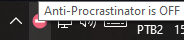
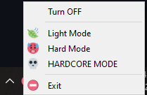

<p>
  
</p>

# Anti-Procrastinator

<p>
  
</p>

Made a better version of this idea: https://youtu.be/_5pH_tr7uN0?t=196

<br>

<p align="center">
  
  
  
</p>

---

## 🤔 How to use

just double-click the [Anti-Procrastinator](./Anti-Procrastinator.exe) and be happy 😀.

# BUT:

If you want to run it manually:

Requirements:

-   [Python](https://www.python.org/)

First and foremost, to run this script its necessary that you create your virtual environment in this folder:

```bat
python -m venv venv
```

With the venv set, you need to install the [dependencies.txt](/dependencies.txt):

```bat
call venv/Scripts/activate.bat
pip install -r dependencies.txt
call venv/Scripts/deactivate.bat
```

After installing the dependencies, just run `bat main.py`

---

## 🚀 How to make it initialize with your Windows

Create a shortcut to [Anti-Procrastinator](./Anti-Procrastinator.exe) and put it to your Startup folder. To open your Startup folder just hit Windows+R to open the “Run” box, type “shell:startup”, and then press Enter.

---

## 🤝 Contributing

Contributions, issues and feature requests are welcome!<br />Feel free to check [issues page](https://github.com/abacaxiguy/blue_spotify/issues).

---

## 📋 Tested in

-   Windows 10

---

<h4  align="center">Developed by 🍍</h4>
